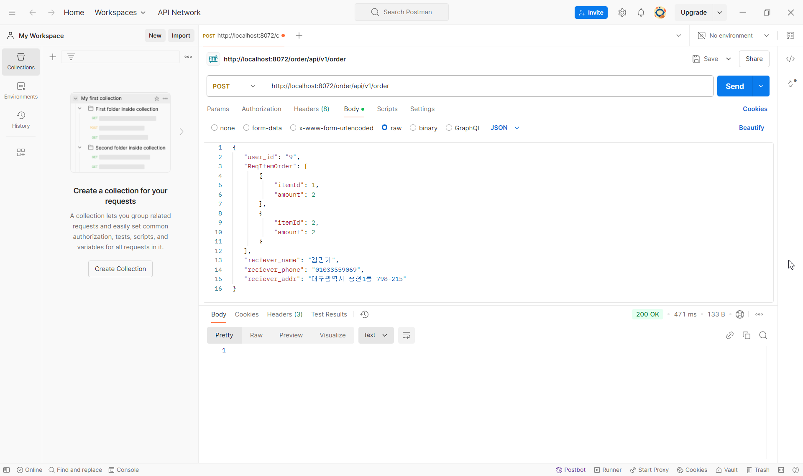
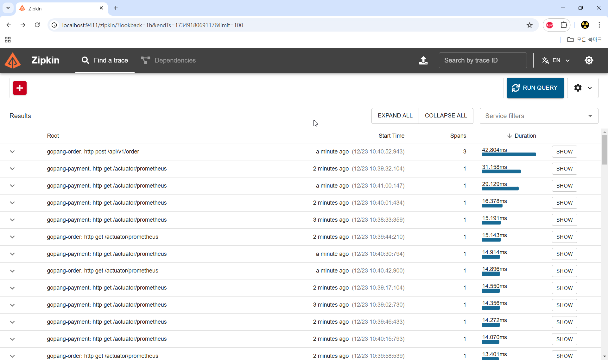
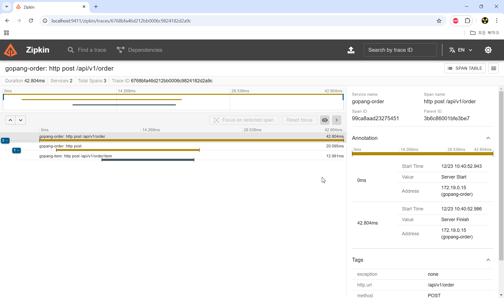
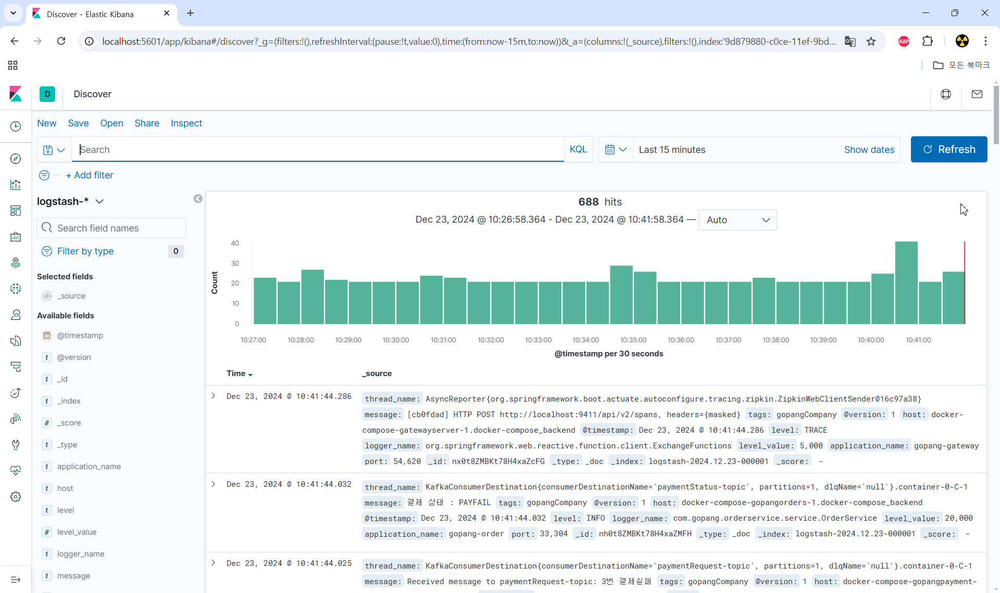
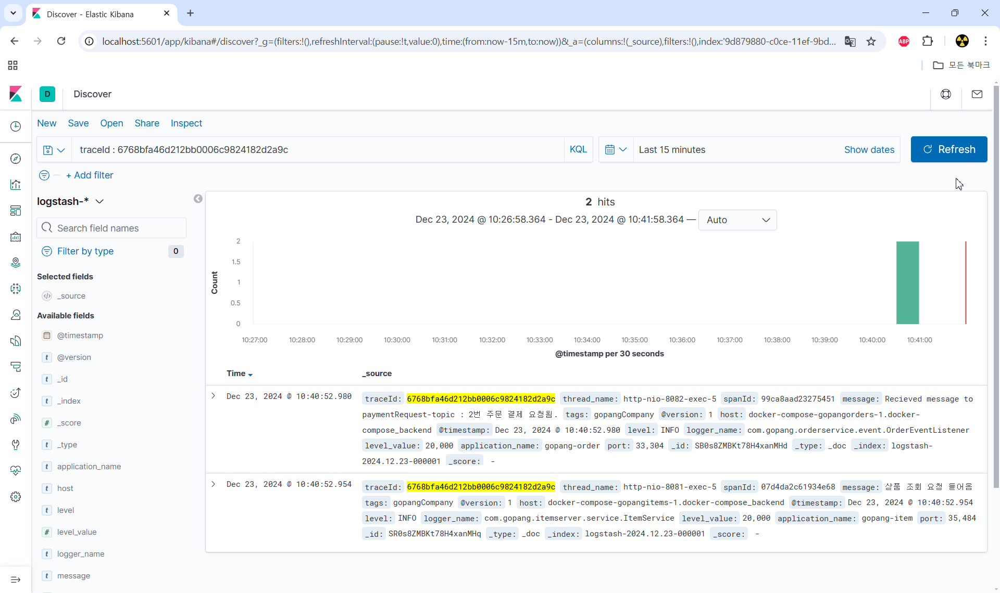
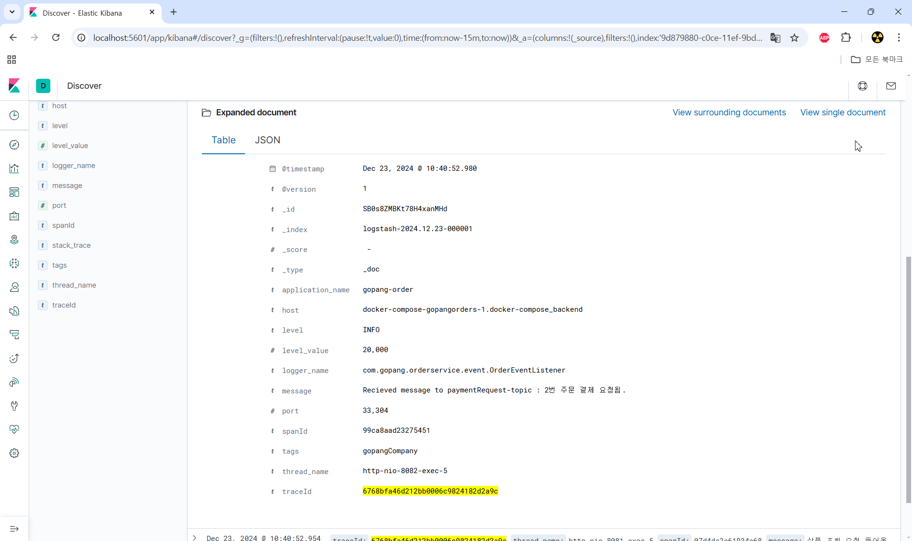
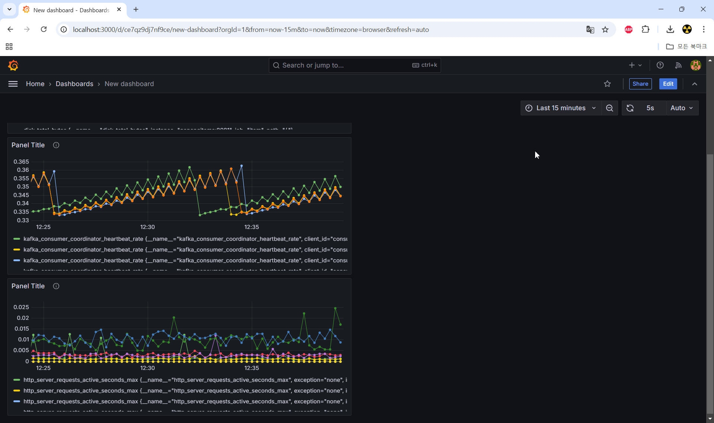

# gopang-microservice
현재 configserver/src/main/resource/bootstrap.yml 파일에는 깃허브 패스워드가 누락되어있습니다. <br>
```
  cloud:
    config:
      server:
        git:
          default-label: main
          uri: https://github.com/kkang45597/Gopang-config
          username: kkang45597
          password: 
          refresh-rate: 60
```
실행하기 위해선 Gopang-config 리포지토리를 생성하고 파일을 넣은 뒤, 자신의 깃허브 아이디와 패스워드 토큰을 사용해야 합니다.

### [[ 프로젝트 PDF ]](https://github.com/kkang45597/Goppang-project/blob/main/Gopang%20Project.pdf) [[ Gopang-config ]](https://github.com/kkang45597/Gopang-config)

## POSTMAN
docker-compose 실행 후, http://localhost:8072/order/api/v1/order 으로 아래 Body를 보내서 확인할 수 있습니다. <br>
```
{
   "user_id": "9",
   "ReqItemOrder": [
       {
           "itemId": 1,
           "amount": 2
       },
       {
           "itemId": 2,
           "amount": 2
       }
   ],
   "reciever_name": "홍길동",
   "reciever_phone": "00012345678",
   "reciever_addr": "주소"
}
```
<br>

---
## Zipkin
docker-compose 실행 후, http://localhost:9411/zipkin 으로 접속하여 확인할 수 있습니다.<br>
<br>

<br>

---
## Kibana
docker-compose 실행 후,http://localhost:5601/app/kibana#/discover으로 접속하여 확인할 수 있습니다.<br>
<br>

<br>

<br>

---
## Prometheus
docker-compose 실행 후,http://localhost:3000/dashboards로 접속하여 확인할 수 있습니다.<br>
<br>

